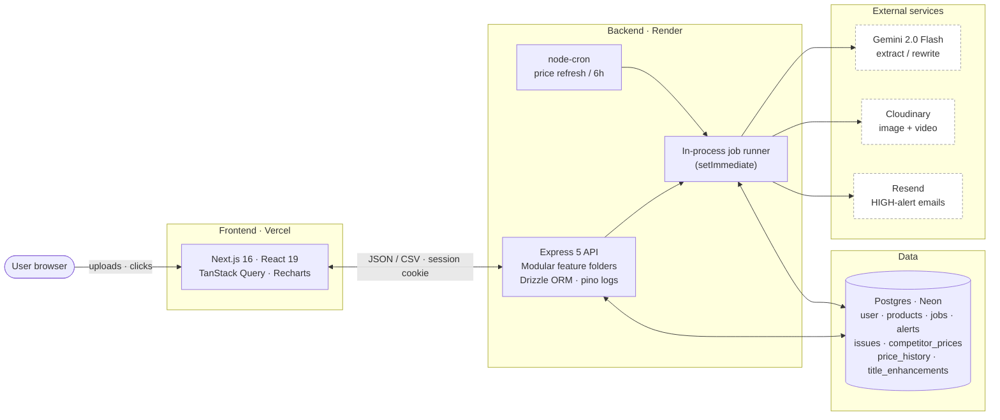
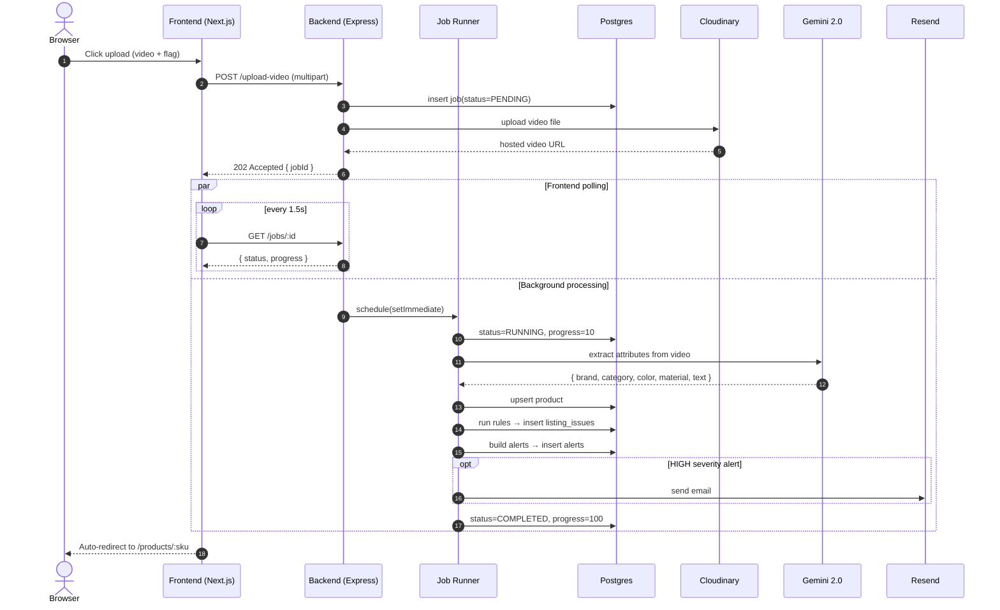

# Architecture

> Short architecture explanation for the Product Intelligence Dashboard (2026 intern assignment, spec §14.7). For the full feature/setup walkthrough see [`README.md`](./README.md).

---

## 1. High-Level Diagram



The system is intentionally a single backend service backed by a single Postgres — small enough to reason about, big enough to demonstrate every spec requirement.

---

## 2. Component Responsibilities

### 2.1 Frontend — `frontend/`
- **Next.js 16 App Router.** Route groups split auth (`/(auth)`) from the dashboard shell (`/(dashboard)`).
- **TanStack Query** owns all server state. Job-detail pages poll `/jobs/:id` at 1.5 s so the user sees real-time progress; on `COMPLETED` they auto-redirect to the product detail page.
- **Optimistic mutations** for product edits and alert dismissals.
- **Recharts** renders the per-SKU price-history chart.
- **`@react-pdf/renderer`** produces a downloadable product PDF; backend produces the catalog-wide CSV report.
- **Better Auth client SDK** handles signup/login; the session cookie is automatically attached to API calls.

### 2.2 Backend — `backend/src/`
Feature-based module layout — each module owns its own routes, controller, and service:

```
modules/
  auth/          Better Auth bridge (all /auth/* routes)
  health/        liveness probes
  video/         POST /upload-video  →  creates `video` job
  csv/           POST /upload-products-csv  →  creates `csv` job
  products/      CRUD + image upload + issues
  enhancement/   POST /products/:sku/enhance-title (Gemini)
  competitors/   CSV upload, manual entry, refresh, history
  dashboard/     quality-summary + CSV export
  alerts/        list, dismiss, plus the alert-engine
  jobs/          list + get, runner orchestration
  validation/    pure rule functions + quality-score
```

Cross-cutting concerns sit in `shared/` (auth middleware, error responses) and `integrations/` (Gemini, Cloudinary, Resend, cron, Better Auth setup).

### 2.3 Database — Postgres (Neon)
- Drizzle ORM with typed inferred row types (`Product`, `Job`, etc.).
- Every owning table carries `user_id` for multi-tenant isolation.
- See [`README.md` §6](./README.md#6-data-model) for the full schema table and ER diagram.

### 2.4 Integrations
| Concern | Service | Why |
| --- | --- | --- |
| Multimodal extraction | Gemini 2.0 Flash | Cheapest fast multimodal model with strong image/video understanding |
| Media hosting | Cloudinary | Free tier, CDN-backed, handles both video and image |
| Outbound email | Resend | Lowest-friction transactional email + good React Email integration |
| Authentication | Better Auth | First-class Drizzle adapter, cookie-based sessions, multi-tenant friendly |
| Scheduling | node-cron | Zero infra, sufficient for single-instance deploy |

---

## 3. Core Workflows

### 3.1 Video / CSV Ingestion (spec §3 steps 1–6, §9)

```
 user ─► POST /upload-{video,products-csv}
            │
            ▼
       jobsService.create()       status = PENDING
            │
            ▼
       jobsRunner (setImmediate)  status = RUNNING, progress = 0..100
            │
            ├─► (video) gemini.extract()  →  attribute JSON
            │
            ├─► upsert products
            │
            ├─► validation.run() for every SKU
            │       ├─► persist listing_issues
            │       └─► recompute products.quality_score
            │
            ├─► alert-engine.buildAlerts()  →  persist alerts
            │       └─► HIGH severity → resend.send()
            │
            └─► jobsService.complete()  status = COMPLETED | PARTIALLY_COMPLETED
                                          on throw → status = FAILED + error message
```

- The HTTP request returns `202 Accepted` with the `jobId` immediately.
- The frontend's polling query reads the job row until `progress === 100` or status terminal, then invalidates the product cache and redirects.

### 3.2 Title Enhancement (spec §4.3)
1. Client clicks **Enhance title** on the product detail page.
2. `POST /products/:sku/enhance-title` calls Gemini with `(original_title, extracted_attributes, category_keywords)` from `enhancement/keywords.ts`.
3. Response stored in `title_enhancements` for audit and shown back to the user.
4. User clicks **Apply to listing** → `POST /products` upsert with the new title.

### 3.3 Competitor Price Refresh (spec §5, §7)
- **Manual.** `POST /competitor-prices/refresh` (with optional `{ sku }`) seeds a `price_refresh` job that the runner processes.
- **Scheduled.** `integrations/cron.ts` triggers the same refresh path every 6 hours.
- **Simulation engine.** A sinusoidal walker per (sku, platform) produces realistic drift; each tick writes a `competitor_prices` row and an immutable `price_history` row.
- **Alerts** are re-computed after refresh — a ≥15% drop on any platform raises a MEDIUM alert.

### 3.4 Alerts (spec §8)
- `alert-engine.ts` is a pure function: `(product, history, competitors) ⇒ Alert[]`.
- Called after validation and after each price refresh.
- Persisted to `alerts`; HIGH severity additionally fires a transactional email via Resend.

---

## 4. Cross-Cutting Concerns

### 4.1 Multi-Tenant Isolation
- `authMiddleware` rejects requests without a valid Better Auth session.
- Every service-layer query filters by `eq(table.userId, currentUserId)`; there is no global / admin path.
- Foreign keys cascade on user deletion so test accounts clean up neatly.

### 4.2 Job Lifecycle
The `jobs` table is the single source of truth for asynchronous work. Five states match the spec verbatim:
```
PENDING → RUNNING → COMPLETED
                  → PARTIALLY_COMPLETED   (some rows valid, some failed)
                  → FAILED                (terminal error captured in `jobs.error`)
```

### 4.3 Error Handling
- Controllers throw → centralized error middleware returns a sanitized JSON envelope (`{ error, code }`) — internal messages never leak.
- The Gemini path catches `429` quota errors and falls back to a deterministic heuristic so the demo flow never breaks.
- Structured logging via `pino` (request id, user id, route, latency).

### 4.4 Security
- `helmet` for default security headers.
- `cors` locked to the configured frontend origin.
- File uploads gated by Multer with explicit size caps (5 MB CSV / 50 MB video).
- No raw SQL; all queries go through Drizzle's parameterized builder.
- Secrets only read via `process.env`; nothing committed.

---

## 5. Real vs Mocked

| Capability | Real / Mocked | Why |
| --- | --- | --- |
| AI attribute extraction | **Real** (Gemini) | Required to demonstrate the bonus AI flow |
| AI title rewrite | **Real** (Gemini) | Same |
| Email alerts | **Real** (Resend) | Required to demonstrate notification bonus |
| Media storage | **Real** (Cloudinary) | Needed for persistent demo |
| Competitor prices | **Mocked** (simulation engine) | Spec §7 discourages live scraping; mock gives reliable charts and alerts |
| OCR | **Implicit** | Folded into Gemini's multimodal pass — no separate OCR stage |

---

## 6. Deployment Topology

| Tier | Host | Notes |
| --- | --- | --- |
| Frontend | Vercel | Next.js 16 with App Router; reads `NEXT_PUBLIC_API_URL` |
| Backend | Render | Node 20 web service; `pnpm run build && pnpm run start` |
| Database | Neon (Postgres) | Serverless branch per environment |
| Media | Cloudinary | Free tier, signed uploads |
| Email | Resend | Single sender domain |

The frontend and backend are deployed independently and only communicate via the documented JSON API + session cookie — no shared runtime.

---

## 7. Notable Design Decisions

1. **Feature-based module layout** (over layered controllers/services/dto). Each spec capability maps to exactly one folder, which made cross-checking against the assignment trivial.
2. **In-process job runner.** A `setImmediate`-backed runner on top of Postgres keeps the infra story to one service + one database — no extra moving parts to operate or explain.
3. **Pure functions for validation and alerts.** `rules.ts` and `alert-engine.ts` take plain inputs and return plain outputs — easy to unit-test, easy to call from both the job runner and ad-hoc admin paths.
4. **Simulated competitor data** chosen over a fragile scraper. Spec explicitly accepts this trade-off.
5. **Drizzle over Prisma.** Lighter runtime, no generation step, and better fit for the existing Neon serverless driver.
6. **Better Auth over rolling our own.** First-class Drizzle adapter and a clean session cookie story let us keep tenancy enforcement to a one-line predicate per query.

---

## 8. Sequence — End-to-End "Upload a Video"



---

## 9. Where to Look in the Code

| You want to read… | Open |
| --- | --- |
| Job state machine | `backend/src/db/schema/jobs.ts`, `modules/jobs/jobs.service.ts` |
| Async runner | `backend/src/modules/jobs/jobs.runner.ts` |
| Validation rules (spec §6) | `backend/src/modules/validation/rules.ts` |
| Quality score | `backend/src/modules/validation/quality-score.ts` |
| Alert engine (spec §8) | `backend/src/modules/alerts/alert-engine.ts` |
| Gemini extraction | `backend/src/integrations/gemini.ts`, `modules/video/video.service.ts` |
| Title rewrite + keywords | `backend/src/modules/enhancement/` |
| Price simulation | `backend/src/modules/competitors/refresh.ts` |
| Auth middleware | `backend/src/shared/middlewares/auth-middleware.ts` |
| Dashboard rollup | `backend/src/modules/dashboard/dashboard.service.ts` |
| Frontend price comparison UI | `frontend/components/competitors/price-comparison.tsx` |
| Frontend job polling | `frontend/app/(dashboard)/jobs/[id]/page.tsx` |
