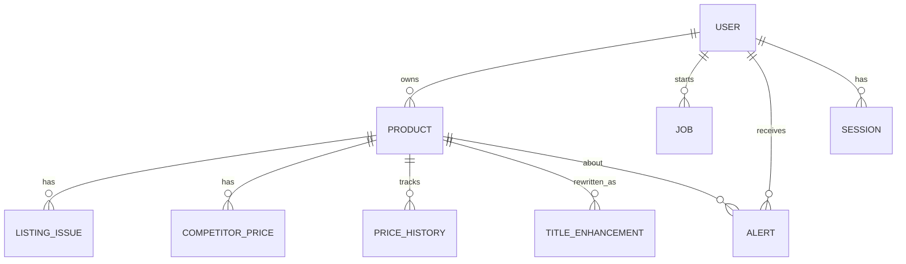

# Product Intelligence Dashboard for E-commerce Sellers

> End-to-end web application that ingests product videos and CSV feeds, validates listing quality, compares competitor prices across marketplaces, and raises actionable alerts — designed for a Flipkart-side seller.

Submission for the **2026 Intern Assignment — Product Intelligence Dashboard**. The project covers every minimum requirement (1–13) and a majority of the bonus list.

---

## 1. Deployment Links

| Surface | URL |
| --- | --- |
| Frontend (Vercel) | `[Insert Deployed Link Here]` |
| Backend API (Render) | `[Insert Deployed Link Here]` |
| Swagger / OpenAPI docs | `{BACKEND_URL}/api/docs` (also served at `http://localhost:9000/api/docs` locally) |
| GitHub repository | `[Insert Repo Link Here]` |

**Demo credentials** (so reviewers can skip signup):
- Email: `test@gmail.com`
- Password: `test1234`

---

## 2. Tech Stack

### Frontend (`/frontend`)
- **Framework:** Next.js 16 (App Router) + React 19
- **Styling:** Tailwind CSS v4 + Radix UI primitives + `lucide-react`
- **Data layer:** TanStack Query v5 (background polling for jobs, optimistic mutations)
- **Charts:** Recharts (price-history visualization)
- **PDF/CSV export:** `@react-pdf/renderer` (frontend), `csv-stringify` (backend)
- **Auth client:** `better-auth` browser SDK
- **Notifications:** `sonner` toasts

### Backend (`/backend`)
- **Runtime:** Node.js + Express 5 (modular feature-based architecture)
- **Language:** TypeScript (strict)
- **Database:** PostgreSQL (Neon serverless) via **Drizzle ORM**
- **Auth:** Better Auth (email/password, session cookies, per-row tenancy)
- **AI extraction:** Google Gemini 2.0 Flash (`@google/generative-ai`)
- **Media storage:** Cloudinary (video + product images)
- **Email alerts:** Resend
- **Scheduler:** `node-cron` (background competitor price refresh every 6h)
- **API docs:** `swagger-autogen` + `swagger-ui-express`
- **CSV parsing:** `csv-parse` / `csv-stringify`
- **Validation:** Zod, Helmet, CORS, cookie-parser, pino structured logging

---

## 3. Reviewer's Guide — How to Use the Deployed App

The full intended flow takes ~3 minutes to walk through.

### 3.1 Sign in
Open the deployed frontend → `/login` → enter the demo credentials above (or sign up).

### 3.2 Ingest data (Upload page)
Four input modes — pick any:
1. **Video (primary)** — Upload a short product video. Gemini extracts `brand`, `category`, `color`, `material`, visible packaging text and infers attributes.
2. **Products CSV (fallback / bulk)** — Use the schema in `samples/products.csv` (matches spec Appendix A).
3. **Manual entry** — Type SKU + product details directly. Also used to **edit** existing products.
4. **Competitor CSV** — Bulk ingest market prices using the schema in `samples/competitor-prices.csv` (matches spec Appendix B).

Toggle the **Enhance product title?** flag on the upload form to enable AI-based title rewriting.

### 3.3 Watch the job
On submit you're redirected to the **Job detail** page. The progress bar polls every 1.5 s. The backend transitions the job through `PENDING → RUNNING → COMPLETED / PARTIALLY_COMPLETED / FAILED`. On success it auto-redirects to the new product detail page.

### 3.4 Analyze a product
Open any product:
- **Listing issues** panel — prioritized, severity-tagged (HIGH/MEDIUM/LOW) with suggested fixes.
- **Enhance title** — click to call Gemini, see extracted attributes + injected keywords + the rewritten title, then "Apply to listing" to persist.
- **Manual edit** (pencil icon) — fix any field, upload a real product image to Cloudinary.

### 3.5 Market intelligence (per product)
- Compare your price against Amazon / Myntra / Ajio / Nykaa / Tata Cliq / Meesho.
- Five-metric strip: **Our price · Lowest · Highest · Average · Gap %** with a recommendation pill (Lower price / Competitive / Raise price).
- Recharts line chart of historical price drift per platform.
- "Refresh" button triggers a `price_refresh` job. "Add manual" form for one-off prices.

### 3.6 Quality dashboard
Store-wide rollup: total products, issue counts by severity, missing-image count, invalid-price count, weakest listings, average quality score. Download a CSV quality report.

### 3.7 Alerts page
In-app feed of every alert ever raised, severity-coloured, dismissable. HIGH-severity alerts also fire a real email via Resend.

---

## 4. How to Run Locally

### 4.1 Prerequisites
- Node.js ≥ 20
- pnpm ≥ 9
- A PostgreSQL connection string (Neon free tier works)

### 4.2 Environment variables

Create `backend/.env`:
```env
DATABASE_URL=postgres://...
GEMINI_API_KEY=your_google_ai_key
CLOUDINARY_CLOUD_NAME=...
CLOUDINARY_API_KEY=...
CLOUDINARY_API_SECRET=...
RESEND_API_KEY=...
ALERT_EMAIL_TO=you@example.com
BETTER_AUTH_SECRET=any_long_random_string
BETTER_AUTH_URL=http://localhost:9000/api/auth
CORS_ORIGIN=http://localhost:3000
```

Create `frontend/.env.local`:
```env
NEXT_PUBLIC_API_URL=http://localhost:9000/api
```

### 4.3 Boot the stack
```bash
# 1. Backend
cd backend
pnpm install
pnpm run db:push      # apply Drizzle schema to your Postgres
pnpm run dev          # http://localhost:9000

# 2. Frontend (new terminal)
cd frontend
pnpm install
pnpm run dev          # http://localhost:3000
```

### 4.4 Sample files
- `samples/products.csv` — 5 demo products covering every validation edge case (missing title, broken image URL, missing brand, out-of-stock, MRP issues).
- `samples/competitor-prices.csv` — 5 competitor rows across Amazon / Myntra / Ajio.

---

## 5. API Documentation

A full OpenAPI spec is generated by `swagger-autogen` and served at **`{BACKEND_URL}/api/docs`** (Swagger UI).

### Endpoint map (matches spec §11)

| Method | Path | Purpose |
| --- | --- | --- |
| `POST` | `/api/upload-video` | Upload product video → creates `video` job |
| `POST` | `/api/upload-products-csv` | Upload product feed CSV → creates `csv` job |
| `GET` | `/api/jobs` | List jobs (filter by status/type) |
| `GET` | `/api/jobs/:id` | Get job status & progress |
| `GET` | `/api/products` | List processed products |
| `POST` | `/api/products` | Create / upsert product (manual entry & edit) |
| `POST` | `/api/products/upload-image` | Upload product image to Cloudinary |
| `GET` | `/api/products/:sku` | Get product details |
| `GET` | `/api/products/:sku/issues` | Get product-level listing issues |
| `POST` | `/api/products/:sku/enhance-title` | Generate enhanced title via Gemini |
| `POST` | `/api/competitor-prices/upload` | Upload competitor price CSV |
| `POST` | `/api/competitor-prices/refresh` | Refresh / simulate competitor prices |
| `POST` | `/api/competitor-prices` | Add a single competitor price manually |
| `GET` | `/api/products/:sku/competitor-prices` | Competitor prices for a SKU |
| `GET` | `/api/products/:sku/price-history` | Historical price points for charting |
| `GET` | `/api/dashboard/quality-summary` | Quality dashboard rollup |
| `GET` | `/api/dashboard/export-report` | Download CSV quality report |
| `GET` | `/api/alerts` | List alerts |
| `POST` | `/api/alerts/:id/dismiss` | Dismiss an alert |
| `GET` | `/api/health`, `/health/detailed` | Liveness probes |
| `ALL` | `/api/auth/*` | Better Auth handlers (sign-in / sign-out / session) |

All non-auth, non-health routes require a valid Better Auth session cookie and are scoped to the calling user.

---

## 6. Data Model

Postgres + Drizzle. Multi-tenant by `user_id` on every owning table.



| Table | Key columns | Notes |
| --- | --- | --- |
| `user`, `session`, `account`, `verification` | Better Auth schema | Session-cookie auth |
| `products` | `sku_id` (PK), `user_id`, `product_title`, `brand`, `category`, `price`, `mrp`, `image_url`, `product_url`, `availability`, `color`, `size`, `material`, `quality_score`, timestamps | Mirrors spec Appendix A |
| `jobs` | `id` (UUID), `user_id`, `type ∈ video\|csv\|price_refresh\|enhance_title`, `status ∈ PENDING\|RUNNING\|COMPLETED\|FAILED\|PARTIALLY_COMPLETED`, `progress 0-100`, `input_ref`, `result_json`, `error`, `started_at`, `completed_at` | Drives §9 of spec |
| `listing_issues` | `sku_id`, `type`, `severity ∈ HIGH\|MEDIUM\|LOW`, `message`, `suggested_fix` | Output of validation engine |
| `competitor_prices` | `sku_id`, `platform`, `competitor_url`, `competitor_price`, `currency`, `source ∈ mock\|csv\|manual`, `fetched_at` | Mirrors spec Appendix B |
| `price_history` | `sku_id`, `platform`, `price`, `recorded_at` | Time-series for the chart |
| `alerts` | `user_id`, `sku_id`, `severity`, `type`, `message`, `data_json`, `status ∈ NEW\|READ\|DISMISSED`, `created_at` | Driven by `alert-engine.ts` |
| `title_enhancements` | `sku_id`, `original_title`, `attributes_json`, `keywords_json`, `enhanced_title`, `reason` | Audit trail of AI rewrites |

---

## 7. Validation Rules (Spec §6)

All eleven rules from the spec are implemented in `backend/src/modules/validation/rules.ts`:

| Rule | Severity |
| --- | --- |
| Missing title | HIGH |
| Very short title (< 15 chars) | MEDIUM |
| Missing brand | MEDIUM |
| Invalid price (≤ 0, non-numeric) | HIGH |
| MRP lower than selling price | HIGH |
| Missing image | HIGH |
| Broken image URL (regex http(s)) | MEDIUM |
| Duplicate SKU across catalog | HIGH |
| Weak description (< 30 chars) | LOW |
| Missing important attributes (color/size/material) | MEDIUM |
| Out of stock | LOW |

Each rule returns `{ type, severity, message, suggestedFix }` and is persisted in `listing_issues`. The catalog-wide **quality score** (0–100) is computed in `quality-score.ts` and stored on `products.quality_score`.

---

## 8. Alert Rules (Spec §8)

Implemented in `backend/src/modules/alerts/alert-engine.ts`:

| Trigger | Severity |
| --- | --- |
| Missing title | HIGH |
| Invalid / missing price | HIGH |
| Our price > 10% above lowest competitor | HIGH |
| Weak title (< 15 chars) | MEDIUM |
| Missing key attributes | MEDIUM |
| Competitor price drop ≥ 15% between refreshes | MEDIUM |
| Out of stock | LOW |
| Weak description (< 30 chars) | LOW |

HIGH-severity alerts also trigger a real email via Resend (see §9).

---

## 9. What's Real vs Mocked

| Area | Status | Notes |
| --- | --- | --- |
| Video → attribute extraction | **Real** | Google Gemini 2.0 Flash multimodal. Falls back to a deterministic heuristic on 429s so the demo never breaks. |
| Title enhancement | **Real** | Gemini call with category-aware keyword injection from `enhancement/keywords.ts`. |
| Competitor prices | **Mocked** | A sinusoidal fluctuation engine simulates realistic price drift across platforms. Live scraping is intentionally avoided per spec §7 (no bypassing bot protection). |
| CSV competitor ingest | **Real** | `samples/competitor-prices.csv`. |
| Manual competitor entry | **Real** | One-off prices via UI. |
| Email alerts | **Real** | Resend API, fires on HIGH severity. |
| Image upload | **Real** | Cloudinary. |
| Video storage | **Real** | Cloudinary. |
| Scheduled price refresh | **Real** | `node-cron` every 6 h (also exposed as a manual `Refresh` button per spec §5). |
| Authentication | **Real** | Better Auth with email/password + session cookies. |
| OCR on frames | **Implicit** | Gemini's multimodal model reads packaging text directly — no separate OCR stage. |

---

## 10. Assumptions

1. **Selling platform = Flipkart.** Product prices in the DB represent the seller's Flipkart price; competitors are everything else.
2. **Multi-tenant from day one.** Every row is scoped by `user_id`; there is no admin / cross-tenant view.
3. **Currency is INR** across the demo. The schema stores a `currency` column so this is easy to relax.
4. **AI accuracy isn't critical for grading.** Per spec §4.1, the goal is a working flow — Gemini output is shown to the user for review, not auto-trusted.
5. **Category keyword map** is limited to five high-traffic e-commerce categories (Shoes, Dresses, Watches, Audio, Bags). Other categories fall through to a generic keyword set.
6. **Job runner is in-process.** `setImmediate`-backed async runner — sufficient for the demo and matches the spec's "mocked or simulated integrations are acceptable" guidance.
7. **Demo emails** go to `ALERT_EMAIL_TO`, not the signed-in user — keeps the demo address controllable.

---

## 11. Trade-offs & Known Limitations

- **No automatic job retry.** Failed jobs are logged with the error message; a reviewer can re-upload to retry.
- **In-process scheduler.** `node-cron` ties the price refresh to the backend process — fine for a single-instance deploy, would need a leader-election story across replicas.
- **Competitor data is simulated.** No live marketplace scraping (a deliberate scope decision matching spec §7).
- **Gemini quota.** Free-tier Gemini will rate-limit after a few rapid uploads; the deterministic fallback keeps the UI alive but yields lower-quality extractions.
- **No tests yet.** Unit + integration tests around the validation engine and alert engine are the obvious next addition.
- **Video duration cap** of 50 MB enforced by Multer; longer videos rejected.
- **Quality score** uses a simple weighted-deduction formula — meaningful enough for the dashboard, not calibrated against real seller benchmarks.

---

## 12. What I'd Improve With More Time

1. **Add Postgres-driven full-text search** on products + alerts (currently client-side filtering only).
2. **Real OCR fallback** when Gemini quota is exhausted (e.g. Tesseract on frame samples extracted via `ffmpeg`).
3. **Slack / Telegram notification adapter** alongside the existing Resend integration.
4. **Vitest suite** covering every rule in `validation/rules.ts` and `alert-engine.ts` (the most business-critical code).
5. **Per-user alert-rule overrides** via the optional `POST /alerts/rules` endpoint from spec §11.
6. **Dockerfile + Compose** so reviewers can run `docker compose up` instead of installing pnpm + Postgres locally.
7. **Better video frame strategy** — currently the whole video is sent to Gemini; sampling frames at scene-change boundaries would cut cost and latency.

---

## 13. Project Layout

```
.
├── backend/                # Node.js + Express 5 API
│   └── src/
│       ├── modules/        # Feature-based: alerts, auth, competitors, csv,
│       │                   # dashboard, enhancement, health, jobs, products,
│       │                   # validation, video
│       ├── db/             # Drizzle schema + client
│       ├── integrations/   # gemini, cloudinary, resend, cron, auth
│       ├── shared/         # middlewares, http helpers
│       └── docs/           # generated swagger.json
├── frontend/               # Next.js 16 dashboard
│   └── app/
│       ├── (auth)/login    # Better Auth UI
│       └── (dashboard)/    # upload · jobs · products · alerts · dashboard
├── samples/
│   ├── products.csv        # Spec Appendix A
│   └── competitor-prices.csv  # Spec Appendix B
├── ARCHITECTURE.md         # Short architecture write-up
└── README.md               # You are here
```

---

## 14. Coverage Against Spec

| Spec section | Status |
| --- | --- |
| §3 Expected user flow (10 steps) | Implemented end-to-end |
| §4.1 Video input | Real Gemini extraction + fallback |
| §4.2 CSV fallback | Implemented with sample file |
| §4.3 Title enhancement flag | Implemented + AI rewrites |
| §5 Core requirements (10 areas) | All implemented |
| §6 Validation rules (11) | All implemented |
| §7 Competitor pricing scope | Mock + CSV + manual entry (live scraping skipped per spec) |
| §8 Alert rules (5) | All implemented |
| §9 Job tracking | 5-state machine, polling UI |
| §10 UI screens (8) | All present |
| §11 Suggested APIs | All present (`/alerts/rules` not added — spec marks optional) |
| §12 Minimum features (13) | All shipped |
| §13 Bonus features | Implemented: AI extraction, AI title rewrite, email alerts, scheduled refresh, price-history chart, downloadable report, auth, Swagger docs |

---

*Created by Priyanshu Bharti, 2026.*
